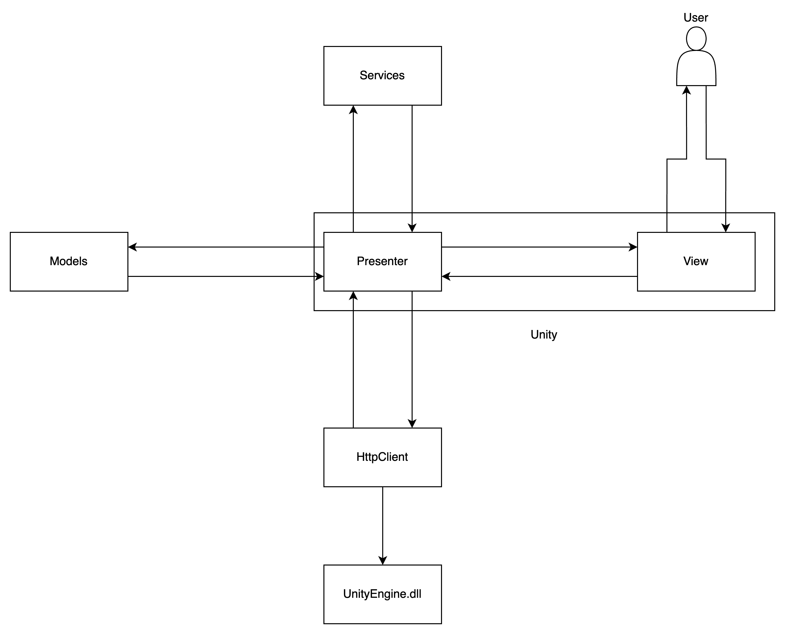

# General Software Architecture

# Overview

Due to the use of unity as our game engine, we will incorporate their architecture suggestions. We follows a blog post from the unity team which can be found [here](https://unity.com/how-to/build-modular-codebase-mvc-and-mvp-programming-patterns). Where they talk about the use of MVC inside unity application. Instead of MVC they use a similar concept called MVP, Model View Presenter. We will follow this concept with our own twist.  

# Why

When you split a application and spread the responsibility of the code. It becomes easier to isolate issues, replace certain parts of the application, with out heavily impacting the whole application. It become easier to maintain the whole application. This way its also possible to repo a certain part of the application in a other language or framework.

# View

The view will be the interface that the user sees and interacts with.  
A difference between MVC and MVP is that the view is also responsible for handling user input. Rather then the controller like in MVC. When the user interacts with the unity UI. The view will send those inputs back to the presenter via UI events.

# Presenter

The Presenter is the middel man between, the service layer of the application and the View interface. It holds the game engine specific implementation to connect the UI events that are send from the view. To the service layer to manipulate the model or run specific logic. When a model is changed the Presenter will react based on a state-changed event from the model.

# Service

The service layer will be split up into two sections, the data service and the logic service layer. We will do this to ensure every service has a clear single purpose. It will not execute logic and manipulate data in the same service. There will be a clear separation of concerns.

## Data Service

As the name indicates these services will query data from repositories, API or on system files. These services will only query and manipulate the data. But these will not contain any actual decision making or "business logic".

## Logic Service

As the name indicates these services will contain the logic part of the application. These services may contain "business logic". They will not handle any data manipulation but only will execute specific logic with the given data.

# Models

A model is a collection of data. Unlike the MVP model by Unity and the MVC model the model will not hold any manipulation logic itself, we will use services for that task. Models should only implement state-change logic and getters and setters.

# Sources

[https://arc.net/l/quote/eeiicwcg](https://arc.net/l/quote/eeiicwcg)  
[https://github.com/Unity-Technologies/game-programming-patterns-demo/tree/main/Assets/12 MVP](https://github.com/Unity-Technologies/game-programming-patterns-demo/tree/main/Assets/12%20MVP)